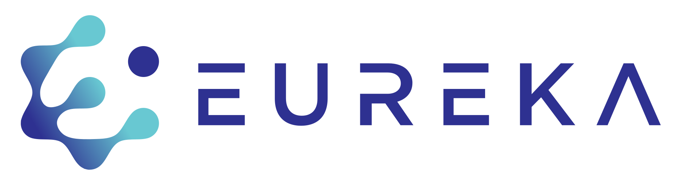
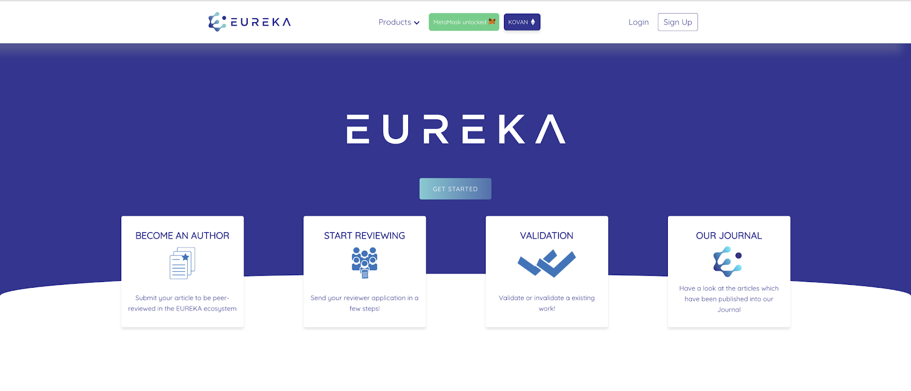

Implementation of a blockchain-based rating-publishing system. The EUREKA
ecosystem is a scientific rating-publishing platform with the Ethereum
blockchain as main infrastructure. EUREKA exploits blockchain technology and
smart contracts to enable a more efficient and trustworthy publishing process by
introducing time stamping for discoveries, rewarding reviewers, editors and
referenced authors and decentralising publishing. The EUREKA Token (EKA) is a
utility token and is a ERC20 combined with ERC667 token, thus it will follow
token standards provided by the Ethereum protocol, meaning it can be sent and
received in transactions on the Ethereum ecosystem.

## Our Social Media
> Medium: https://medium.com/eureka-token/

> Twitter: https://twitter.com/TokenEureka/

> Facebook: https://www.facebook.com/TokenEureka/

> Instagram: https://www.instagram.com/tokeneureka/

> Linkedin: https://www.linkedin.com/company/eurekatoken/



## Website

> EUREKA token (EKA) description: https://eurekatoken.io


# Prerequisites

## How to build

```
$ git clone git@github.com:eureka-blockchain-solutions/eureka-platform.git
$ cd eureka-platform
$ yarn
```

#### Build Client

```
npm run dev-client
```

> Default dev port: `http://localhost:3000/`

#### Create & start MongoDB locally

Create directory at:

> Windows:  `C:\data\db`

> Unix:     `data/db`

Start mondoDB service:
```
mongod
```

Connect to service:
```
mongo
```

Use a new DB:
```
use eurekaDB
```

Create a new DB admin:
```
db.createUser({
	user: "admin",
	pwd: "admin",
	roles: [{
		role: "dbAdmin",
		db:"eurekaDB"
		}]
})
```

Insert something into the DB to save the DB:
```
db.testData.insert({"test": "test"})
```

Check created DB:
```
show dbs
```

Create ``.env`` file in root of project folder (``eureka-platform``) with content:
```
DB_HOST=localhost
DB_NAME=eurekaDB
DB_USER=admin
DB_PASSWORD=admin
```

#### Deploy Contracts to Ganache

```
npm run deploy-contracts
```

#### Build Server and connect the monitor...
##### ... to Ganache
```
npm run gan-server
```

##### ...to Kovan Network
```
npm run kov-server
```

> Default dev port: `http://localhost:8080/`

### Testing

```
npm run test
```
or 
```
npm run test-ci
```

#### Testing strategy

**Local testing:**  
    1. DB must be running on port 27017 (see Create & start MongoDB locally).   
    2. Ganache must be running on port 7545.  
    3. run 'yarn run test'.

**Dev testing:**  
    only application-intern unit-tests.
    
**Test testing:**  
    1. DB on: https://app.compose.io/science-matters-ag/deployments/eureka-platform-mongodb/mongodb/databases/test-eureka-platform/collections  
    2. SC is deployed to //TODO  
    3. Runs all types of tests
    
**Master testing:**  
    1. DB on:  https://app.compose.io/science-matters-ag/deployments/eureka-platform-mongodb/mongodb/databases/eureka-platform/collections  
    2. SC is deployed to ethereum main-net
    3. runs only application-intern unit-tests
     
| Branch\ Test-type       | Unit test        | DB test  | SC Integration test |
| ----------------------- |:----------------:| --------:|--------------------:|
| **Local**               |        Yes       |   Yes    |        Yes          |
| **Dev**                 |        Yes       |   No     |        No           |
| **Test**                |        Yes       |   Yes    |        Yes          |
| **Master**              |        Yes       |   No     |        No           |

Testing is done with ava. Based on the branch (see table) only specific test-files are executed. (e.g. on 'dev' only the file NormalTests.js).
When new test-files are created the script in package.json needs to be updated.

```
"test-ci": "if [ \"${CIRCLE_BRANCH}\" = \"dev\" ]; then ava --serial ./test/NormalTests.js; elif [ \"${CIRCLE_BRANCH}\" = \"master\" ]; then ava --serial ./test/NormalTests.js; else ava --serial;fi"
```

## How to contribute

Pull requests welcome! Please include tests and follow the style conventions.
Run `npm test`to verify.

## Current Smart Contracts:

Token Contract Address (Kovan Testnet): `0xad9a8e2f14820f9c2a8f39bb501fba891f9f990a`

Platform Contract Address (Kovan Testnet): `0xad5d2e1a0a17be861dabcb3734c79bec688856ab`


### Contributors

```
Lucas Pelloni
Severin Wullschleger
Andreas Schaufelbühl
Thomas Bocek
Jonathan Burger
```

## License

This project is licensed under the MIT License.

## Acknowledgments
* EUREKA Blockchain Solutions GmbH
* ScienceMatters AG
* University of Zurich
* Creative Tim for open-source Argon design system (https://www.creative-tim.com/)
